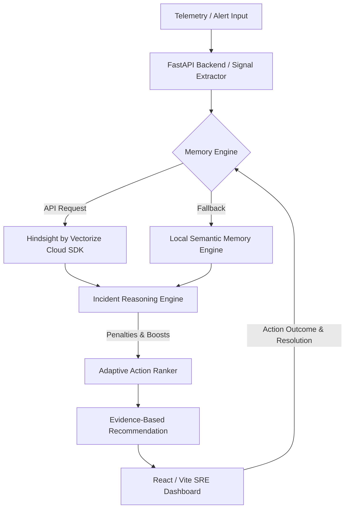

# IncidentMind — AI SRE Agent With Long-Term Memory

> **Powered by Hindsight by Vectorize**  
> *Every resolved incident becomes experience for the next one.*

---

## 1. Problem Statement

Modern AI SRE and DevOps agents can analyze logs and metrics for today's active incident. However, standard LLM-based agents have a critical flaw: **they lack long-term operational memory**. 

When a recurring outage happens, standard agents evaluate the incident in isolation and repeatedly suggest generic trial-and-error steps—such as scaling cache size or restarting pod replicas—wasting precious outage minutes (MTTR ~ 45 mins).

## 2. Solution: IncidentMind

**IncidentMind** is an adaptive AI Site Reliability Engineering teammate that remembers how systems failed in the past. Powered by **Hindsight by Vectorize**, IncidentMind stores postmortems, failed diagnostic attempts, successful resolutions, and engineering decisions in persistent long-term vector memory.

When a new incident occurs, IncidentMind retrieves relevant operational experiences and uses them to **change its recommended troubleshooting strategy**—penalizing previously ineffective actions and fast-tracking proven fixes.

---

## 3. Key Innovation: Memory Changes Agent Behavior

Unlike generic RAG assistants that merely display retrieved postmortems in a sidebar, IncidentMind's reasoning engine directly integrates memory into its decision pipeline:

```
NEW INCIDENT
    ↓
EXTRACT SIGNALS (Metrics, Logs, Symptoms, Deployments)
    ↓
SEARCH HINDSIGHT VECTOR BANK
    ↓
RECALL HISTORICAL EXPERIENCES
    ↓
PENALIZE HISTORICAL FAILURES (e.g. Cache Scaling)
    ↓
BOOST HISTORICAL SUCCESSES (e.g. DB Pool Inspection)
    ↓
DETERMINISTIC RECOMMENDATION (Memory Influence: HIGH)
```

### Side-by-Side Evaluation: Memory OFF vs Memory ON

| Metric / Dimension | Memory OFF (Standard SRE Agent) | Memory ON (IncidentMind + Hindsight) |
| :--- | :--- | :--- |
| **Top Recommendation** | Generic Cache Scaling (`Increase Redis Cache Size`) | Targeted DB Pool Inspection (`Inspect DB Connection Pool`) |
| **Past Failure Awareness** | ❌ None (Repeats failed cache scaling attempt) | ✅ High (Suppresses cache scaling & flags as failed) |
| **Investigation Speed** | ⚠️ Trial-and-Error (~45 Mins MTTR) | ⚡ Immediate (~3 Mins MTTR) |
| **Reasoning Transparency** | Generic metric heuristic | Evidence-Based Deterministic Chain (`Current + Memory`) |

---

## 4. Architecture



---

## 5. Hackathon Demo Workflow (`INC-1042` → `INC-1087`)

1. **Historical Baseline (`INC-1042`)**:
   - High API Latency (4.8s), DB Connections 98%.
   - Attempt 1: *Increase Cache* → **FAILED**.
   - Attempt 2: *Restart Containers* → **FAILED**.
   - Attempt 3: *Inspect DB Pool* → **SUCCESS** (Expanded pool to 300).
   - Experience stored in Hindsight memory bank.

2. **Active Recurrence (`INC-1087`)**:
   - High API Latency (5.1s), DB Connections 96%.
   - Agent searches Hindsight and recalls `INC-1042` (94% similarity).
   - Cache scaling is automatically **penalized and avoided**.
   - DB Connection Pool inspection is **boosted to Priority #1**.

3. **Scenario 2 — Auth JWT Failure (`INC-1011` → `INC-1099`)**:
   - Proves non-hardcoded behavior on authentication secret rotation failure.
   - Pod restart is penalized; JWT key secret inspection is prioritized.

---

## 6. System Requirements & Technology Stack

- **Backend**: Python 3.10+, FastAPI, Pydantic v2, `hindsight-client` SDK, `pytest`
- **Frontend**: React 18, Vite, TypeScript, Tailwind CSS, Lucide React Icons
- **Memory**: Hindsight by Vectorize (with local semantic engine fallback)

---

## 7. Quickstart Guide

### Step 1: Clone Repository
```bash
git clone https://github.com/your-org/IncidentMind.git
cd IncidentMind
```

### Step 2: Configure Environment
```bash
cp .env.example .env
```

### Step 3: Start Backend Server
```bash
cd backend
python -m venv venv
# On Windows:
venv\Scripts\activate
# On Linux/macOS:
source venv/bin/activate

pip install -r requirements.txt
uvicorn app.main:app --reload --port 8000
```

### Step 4: Start Frontend Server
In a new terminal window:
```bash
cd frontend
npm install
npm run dev
```

Open `http://localhost:5173` in your browser.

---

## 8. Environment Variables

Configure `.env` in the root directory:

```env
# Application Settings
PROJECT_NAME="IncidentMind AI SRE"
ENVIRONMENT="development"

# Backend Server Configuration
HOST="0.0.0.0"
PORT=8000
CORS_ORIGINS=["http://localhost:5173", "http://127.0.0.1:5173"]

# Hindsight by Vectorize Configuration
HINDSIGHT_API_KEY=""
HINDSIGHT_BANK_ID="incidentmind_sre"
HINDSIGHT_BASE_URL="https://api.vectorize.io/hindsight/v1"
```

---

## 9. Running Tests & Production Builds

### Backend Automated Test Suite
```bash
cd backend
python -m pytest tests/test_hindsight_loop.py -v
```

### Frontend Typecheck & Production Build
```bash
cd frontend
npm run build
```

---

## 10. System Status & Health Check

Query system component health:
```bash
GET http://localhost:8000/api/health
```

Returns backend status, LLM reasoning status, Hindsight connection mode, and demo dataset metrics.

---

## 11. Limitations & Future Integration Roadmap

### Limitations
- Currently uses realistic simulated incident telemetry and synthetic failure scenarios for hackathon demonstration.

### Future Roadmap
- **Observability Streams**: Integration with Prometheus, OpenTelemetry, Grafana, and Azure Monitor / Application Insights.
- **Infrastructure Connectors**: Native Kubernetes CRD operator, AWS CloudWatch, and GCP Operations Suite.
- **Incident Management**: PagerDuty, Opsgenie, GitHub Actions, and Microsoft Teams notifications.
